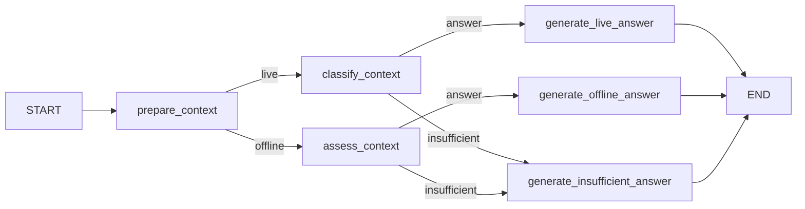

# Schwarzwald Day Planner: live-source RAG demo

This demo answers practical visitor questions using a small, live-fetched corpus from the official [Nationalpark Schwarzwald](https://www.nationalpark-schwarzwald.de/) visitor-information pages. The student is not searching a fictional handbook: they are building a day planner for a real trip, where access, public transport, trail closures, opening hours, and accessibility information may be spread across several pages and change over time. The source pages are German; the demo keeps the source wording and URLs intact so provenance remains visible.

The pipeline is:

1. read a source registry of official Nationalpark Schwarzwald pages;
2. fetch and clean the current HTML pages;
3. cache each page with its source URL, title, and fetch time;
4. split the live corpus into chunks;
5. embed chunks locally and persist them in Chroma;
6. retrieve evidence for a visitor question; and
7. generate a concise answer with citations.

## Run the live demo

```bash
cd rag-lesson/demo
python -m venv .venv
source .venv/bin/activate
pip install -e .
cp .env.example .env
python src/ingest.py --refresh --reset
python src/rag_pipeline.py --question "How can I reach the Nationalparkzentrum Ruhestein, and does the official page mention ÖPNV?" --offline
python src/evaluate.py --offline
```

The `--refresh` flag fetches the current pages from `nationalpark-schwarzwald.de`; the cached Markdown files are ignored by git so a learner can repeat the experiment later and compare what changed. Embeddings run locally. Live answer generation and the optional model judge use Groq.

Try a real planning question:

```bash
python src/rag_pipeline.py \
  --question "What should I check before hiking in the Nationalpark Schwarzwald?"
```

Use `--offline` to inspect retrieval and exercise the same LangGraph routing without a Groq key. The offline answer is a deterministic context extract, not a replacement for the live model response.

## Live-source design choices

- `data/sources.json` is the editable source registry. Each entry names a specific official page rather than crawling the entire NPS site.
- `src/fetch_sources.py` uses a descriptive user agent, extracts the main article content, removes navigation and scripts, and records `fetched_at` for provenance.
- A failed refresh stops the run instead of silently presenting stale pages as current.
- The vector store contains visitor-information text and metadata, not pre-written answers.

## Inspect the answer graph

`generate_answer` is only a graph invocation. The named LangGraph nodes make answerability visible:



The useful student question is no longer “does the toy answer work?” It is: “What does the current official visitor guidance say, which page supports it, and what should I verify again before I travel?”
